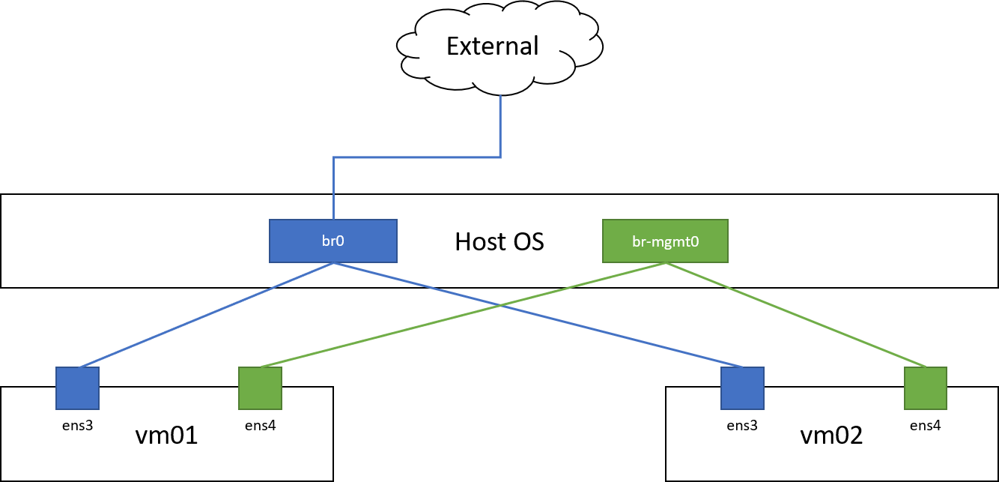

# terraform-kvm

Example file for managing 2 ubuntu servers on KVM by terraform.

**NOTE**: This is for my reference. I do not recommend to use it in a production environment.

## Topology

For simplifying the explanation, the figure omits some technical details, for instance, the interface name connected to the external network, etc.



Each VM has 2 interfaces: `end3` and `ens4`.
* `ens3` is connected to the external network
* `ens4` is for the management interface.
  * Terraform automatically create a virtual network named `mgmt0`.
  * `br-mgmt0` will be automatically created on host OS by terraform.

We assume that host OS has `br0` interface (it is used for bridging external network)
* Network range is 192.168.128.0/24
* Gateway address is 192.168.128.1
* No DHCP

By default, terraform creates 2 users (defined in `cloud_init.cfg` in each directory)
* user (with sudo): `terraform` / `UserPassword!`
* root: root / `RootPassword!`

## Run

Before running this, you need to install [terraform-provider-libvirt](https://github.com/dmacvicar/terraform-provider-libvirt).

All the following command should be run as root.

**Setup VM and network**

```bash
terraform init
terraform apply
```

**Delete VM and network created by terraform**

```bash
terraform destroy
```
